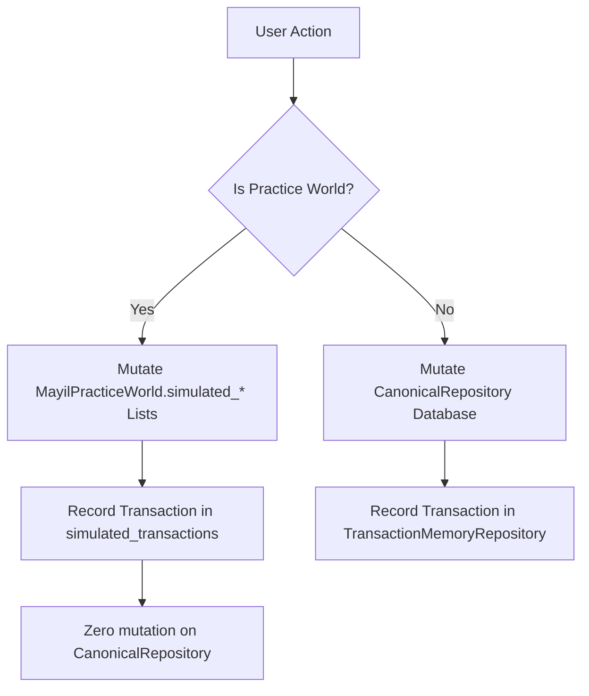

# FEMC Canonical Reconciliation Audit Report

**Audit Commit Baseline:** `ffe8105`<br>
**Active Branch:** `reconcile/femc-execution-plan`<br>
**Date:** August 14, 2026<br>
**Status:** COMPLETED — AUDIT & RECONCILIATION ONLY<br>

---

## A. Repository Truth & Directory Inventory

An inspection of the local filesystem layout reveals the active structure of the Family Event Memory Calendar (FEMC):

```
ENGINEERING/
  source/
    femc/
      api.py             # FEMCApi facade - primary integration surface
      models.py          # Enums and Dataclasses representing core types
      repositories.py    # Memory-backed stores: Canonical, Derived, TransactionMemory
      services.py        # Business logic: Event, Memory, Sharing, Mayil, Guardian
  tests/
    test_femc_*.py       # Unit and integration test suite (206 total tests)
run.py                   # Presentation layer: DemoState and HTTP request handler (3183 lines)
docs/
  audits/
    femc_forensic_audit_ffe8105.md  # Original forensic audit draft
```

### Key Metrics:
- **Markdown Inventory:** Over 770 markdown files exist in the repository, representing various architectural, constitutional, and governance generations.
- **Durable Authority Index:** `CONSTITUTION/MASTER_INDEX.md` acts as the master navigation index.
- **Stale Documentation:** `ARCHITECTURE/README.md` is outdated and list elements do not align with the actual content of the `ARCHITECTURE/` directory.

---

## B. Mayil Reconstruction & Implementation Map

Mayil AI exists as a core service framework structured to analyze family context and suggest actionable interventions:

1. **`MayilService` (`services.py`):**
   - Implements context analysis logic, parsing historical events and memories (within privacy visibility boundaries) to output natural-language insights.
   - Generates event proposals (`ActionProposal`) which remain in `PROPOSED` status until a human user approves or rejects them.
2. **`MayilGuidedExperienceService` (`services.py`):**
   - Orchestrates guided user onboarding tours.
   - Governs two distinct mock execution interfaces: `WATCH_JOURNEY` and `LEARN_BY_DOING`.
   - Initializes a sandboxed environment (`MayilPracticeWorld`) containing synthetic events, memories, and members.

---

## C. State Ownership Mapping

State tracking is strictly partitioned across three storage structures managed in memory:

1. **Authoritative Canonical State (`CanonicalRepository`):**
   - Owns the primary tables: Accounts, Persons, Groups, Events, Memories, Places, Share Links.
   - Mutated only through human actions or explicitly approved Mayil proposals.
2. **Derived/Cached Projections (`DerivedRepository`):**
   - Computes query representations: Calendar feeds, Timeline views, Topology matrices.
   - Volatile and rebuildable on demand; monitored by the Guardian for discrepancy repairs.
3. **Transaction ledger (`TransactionMemoryRepository`):**
   - Append-only journal logging every action signature.
   - Sequenced monotonically via the tiebreaker mechanism `(timestamp, sequence)` to ensure deterministic descent sorting under microsecond collisions.

---

## D. API & Route Ownership

HTTP request dispatch is centralized in `DemoHTTPRequestHandler` inside `run.py`:

- **GET Endpoint Traces:**
  - `/api/history` and `/api/resource_history`: Retrieve authorized chronologies of transactions.
  - `/api/guide/practice/status` and `/api/guide/status`: Expose interactive walkthrough progress.
  - `/api/mayil`: Returns active Mayil insights and proposed events.
  - `/api/guardian`: Polls the data integrity indicators.
- **POST Endpoint Traces:**
  - `/api/guide/practice/action`: Submits a training exercise operation to the sandbox.
  - `/api/guide/validate`: Checks if user clicks matching tour step requirements.
  - `/api/mayil/approve` and `/api/mayil/reject`: Human verification checkpoint.

All request mappings instantiate operations on the singleton `demo_state.api` (wrapping `FEMCApi`), assuring clean decoupling.

---

## E. History Reconciliation & Isolation Boundary

The boundary between real user data and simulated practice operations is maintained through list isolation.



### Practice Sandbox Design:
Simulated mutations during `WATCH_JOURNEY` or sandboxed mode append entities to `simulated_events`, `simulated_memories`, etc., within the active user's `MayilPracticeWorld` instance. They never touch `CanonicalRepository` memory.

### Design Gap (Audit Finding):
When in `LEARN_BY_DOING` mode, the guided steps prompt users to click actual UI components that execute *real* production writes. Consequently, permanent events are created in `CanonicalRepository`, and actual transaction entries with `source="learn_by_doing_exercise"` are committed to the transaction log. There is no automated cleanup logic for these tour-created entities.

---

## F. Audit of "Magic Loop" & Experience Pillars

- **The Magic Loop:** The feedback loop (Mayil suggests $\to$ Human Approves $\to$ Event Created $\to$ Transaction Recorded $\to$ Guardian Validates $\to$ Dashboard Updates) is fully implemented. An approved proposal automatically instantiates the real `Event` and appends a `ProvenanceMetadata` record marking execution.
- **First-User Experience:** The system seeds standard data on initialization, preventing blank screen states. Switching views is required to discover the full family network.
- **Visual & Emotional Resonance:** Subtitle bars, automated voice synthesis (`window.speechSynthesis`), and Speech Recognition provide an immersive accessibility surface. Speech recognition fallback uses file uploads gracefully.
- **Localization Mapping:** Language dictionaries support English, Tamil, and Hindi. Translating language selectors preserves step indices and dynamically updates speech voice profiles.

---

## G. Duplicate & Ambiguity Classifications

The architecture reconciliation process identifies three major directory duplication patterns:

1. **Exact Documentation Duplicacy (Wrong Domain):** 10 markdown documents in `MEMORY/004-MEDIA` to `MEMORY/006-MEDIA` have exact duplicate copies inside `MEDIA/004` to `MEDIA/006`.
2. **Generational Duplicate Numbering:** Numbered sub-folders (`002` through `009`) are duplicated across distinct features (e.g. `ENGINEERING/002-IMPLEMENTATION-GOVERNANCE` vs `ENGINEERING/002-ENGINEERING-DELIVERY-AND-QUALITY`).
3. **Closure Content Overlaps:** Shifting closure specs exist under `CALENDAR/003` / `CALENDAR/006` and `SEARCH/003` / `SEARCH/006`.

---

## H. Risk Assessment & Recommendations

### Architectural Risks:
- **Redundant Documentation (Medium):** Multi-directory duplicates risk documentation drift.
- **Lack of Sandbox Cleanup (Medium):** The accumulation of tour-created items in production tables could populate the user's dashboard with obsolete demo data.

### Experience Risks:
- **Confirmation Safety Gaps (Low):** Actions such as data exports do not prompt for user confirmation warnings.

### Deprecation & Cleanup Sequence:
1. **Consolidate Media:** Retain `MEDIA/` folder definitions and deprecate `MEMORY/00X-MEDIA-*` paths.
2. **Standardize Folder Prefix Coding:** Flatten `ENGINEERING` and `PRIVACY` directories to eliminate duplicative numbered prefix steps.
3. **Introduce Tour Garbage Collection:** Implement a clean-up API calling `DELETE` on all canonical entries flagged with `source="learn_by_doing_exercise"` once a guided session is exited.
