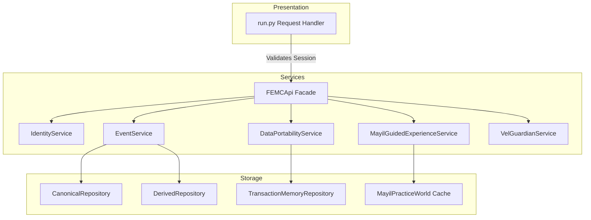

# FEMC V2.4 — Post-P0 Canonical Experience Consolidation Audit Report

## A. Post-P0 Baseline
The repository baseline has been verified. Current HEAD commit is `6cd5a16` (reconcile/femc-execution-plan).
- **Working Tree**: Completely clean.
- **Automated Tests**: 219 tests pass successfully with zero PytestCollectionWarnings or errors.
- **Verification Status**: P0 Learn-by-Doing isolation from the canonical database is fully functional and regression-tested.

---

## B. Canonical Capability Matrix

| Capability | Current Implementations | Callers | Tests | Unique Responsibilities | Proposed Canonical | Compatibility Layer | Evidence |
| :--- | :--- | :--- | :--- | :--- | :--- | :--- | :--- |
| **Identity / Group** | `IdentityService`, `CanonicalRepository.accounts` | `run.py`, `DemoState` | `test_femc.py` | Account onboarding, session tokens, relationship topology mappings. | `IdentityService` | Standard wrapper mapping inside `DemoState`. | `services.py:L142-260` |
| **Session / Perspective** | `IdentityService.create_session`, `DemoState.session_id` | `run.py` routes | `test_femc_privacy_and_sessions.py` | Authorizing access controls based on user role and privacy levels. | `IdentityService` | Session checks in `run.py` routing middleware. | `api.py:L142-152` |
| **Events** | `EventService`, `CanonicalRepository.events` | `run.py`, `MayilService` | `test_femc_calendar_lifecycle.py` | Creating, updating, deleting events; category tagging; status management. | `EventService` | Redirection routing inside `run.py` API handlers. | `services.py:L346-485` |
| **Calendar** | `CalendarService`, `DerivedRepository.calendar_entries` | `run.py` `/api/events` | `test_femc_calendar_lifecycle.py` | Aggregates and filters events chronologically for high-level feeds. | `CalendarService` | Custom calendar feed wrapper mapping. | `services.py:L500-610` |
| **Memories** | `MemoryService`, `CanonicalRepository.memories` | `run.py` `/api/memories` | `test_femc_timeline.py` | Narrative capture for events, privacy controls. | `MemoryService` | Redirection routing inside `run.py`. | `services.py:L700-830` |
| **Media** | `MediaService`, `CanonicalRepository.media_items` | `run.py` `/api/media` | `test_femc_media.py` | Photo and video attachments, album structures, and thumbnail properties. | `MediaService` | GET/POST route bindings in presentation. | `services.py:L850-990` |
| **Celebrations** | `CelebrationStudioService` | `run.py` `/api/celebrations` | `test_femc_celebration_studio.py` | Generates slideshows, highlights, and festive themed cards. | `CelebrationStudioService`| Mapping from LBD mode to simulated artifacts. | `services.py:L1220-1380` |
| **Reminders** | `ReminderService` | `run.py` `/api/reminders` | `test_femc_recurrence_reminders.py`| Schedules and validates upcoming calendar notification queues. | `ReminderService` | Notification mapping facade in `FEMCApi`.| `services.py:L1450-1610` |
| **Notifications** | `NotificationService` | `run.py`, `ReminderService` | `test_femc_sharing_notifications.py`| Manages user-facing in-app logs, alerts, and unread badges. | `NotificationService` | Facade methods on `FEMCApi`. | `services.py:L1650-1790` |
| **Mayil Intelligence**| `MayilService` | `run.py` `/api/mayil` | `test_femc_mayil.py` | Insight engine modeling, anomaly detection in family trees. | `MayilService` | Mock insights in guided sessions. | `services.py:L2100-2340` |
| **Mayil Guided Experience**| `MayilGuidedExperienceService`| `run.py` `/api/guide` | `test_femc_learn_by_doing.py`| Tour choreography, state machines, step validation rules. | `MayilGuidedExperienceService` | Direct mapping to simulator inputs.| `services.py:L2980-3210` |
| **Watch** | `MayilGuidedExperienceService`| `run.py` `/api/guide` | `test_femc_learn_by_doing.py`| Read-only UI showcase of system capabilities. | `MayilGuidedExperienceService` | Intercepted read routes showing mocks. | `services.py:L3100-3160` |
| **Learn-by-Doing**| `MayilGuidedExperienceService`| `run.py` routes | `test_femc_lbd_isolation_boundary.py`| Intercepts mutations, redirects to `MayilPracticeWorld`. | `MayilGuidedExperienceService` | Run-time redirection branches in `run.py`.| `run.py:L2760-3390` |
| **Practice World** | `MayilPracticeWorld` dataclass | `MayilGuidedExperienceService` | `test_femc_practice_world.py`| Sandboxed container storing mock states for session practice. | `MayilPracticeWorld` | Session-scoped dictionary cache. | `models.py:L700-725` |
| **Transaction Memory**| `TransactionMemoryService` | `run.py`, `FEMCApi` | `test_femc_transaction_memory.py`| Journals modification actions across all system tables. | `TransactionMemoryService`| API proxy maps for correlation searches. | `services.py:L2700-2900` |
| **Guardian** | `VelGuardianService` | `run.py` `/api/guardian` | `test_femc_vel_guardian.py` | Automated schema validation, data repair orchestration. | `VelGuardianService` | Status payload formatting. | `services.py:L2400-2650` |
| **Sharing** | `SharingService` | `run.py` `/api/sharing` | `test_femc_sharing_notifications.py`| Live public authentication token generation and revocation. | `SharingService` | Revoke handler switches. | `services.py:L1850-2050` |
| **Export** | `DataPortabilityService` | `run.py` `/api/export` | `test_femc_data_portability.py`| Compiles multi-entity JSON representation of family context data. | `DataPortabilityService`| Mock serializers for sandboxes. | `services.py:L2350-2450` |
| **Search** | `SearchService` | `run.py` `/api/search` | `test_femc.py` | Query indexing using token matches. | `SearchService` | Map query parameters to `DerivedRepository`.| `services.py:L2850-2950` |
| **Timeline** | `TimelineService` | `run.py` `/api/timeline` | `test_femc_timeline.py` | Formats and groups memories by date. | `TimelineService` | Structured JSON mappings in routing. | `services.py:L1020-1150` |
| **Dashboard** | `DashboardService` | `run.py` `/api/dashboard` | `test_femc.py` | Constructs aggregated landing projections (alerts, unread count).| `DashboardService` | JSON packaging. | `services.py:L1170-1300` |

---

## C. Mayil Consolidation

### Trace Analysis
Mayil features are currently fragmented across the codebase:
- `MayilService`: Context analysis, event proposals, approval.
- `MayilGuidedExperienceService`: Governs client tour progress, configures setup data, runs `execute_simulated_action`.
- `MayilPracticeWorld` (in `models.py`): In-memory dataclass holding simulated arrays.

### Target Conceptual Structure
To enforce clean architecture, all Mayil subsystems must align under a consolidated namespace structure:
```
Mayil
 ├── Intelligence (Parsing, insight scoring, next-action discovery)
 ├── Guidance     (Tour progress state machine, step verification)
 ├── Practice     (PracticeWorld operations, simulated states)
 ├── Explanation  (Interpretation of rules vs concrete logs)
 ├── Celebration  (Highlight artifact selection logic)
 └── Audit        (Provenance and compliance validation logs)
```
- **Intelligence**: Owns `MayilService`.
- **Guidance**: Managed by `MayilGuidedExperienceService`.
- **Practice**: Maps sandboxed mutation behaviors.
- **Explanation**: Governs facts interpreter.

---

## D. State Consolidation

State models represent the core execution context:
1. **Real State (Canonical)**: Owned by `CanonicalRepository`. Single source of truth for production events, users, and memories.
2. **Simulated State (Practice)**: Owned by `MayilPracticeWorld`. Temporary collections of mock events and members isolated per session.
3. **Session Identity**: Owned by `IdentityService` session structures. Mapping active account IDs.
4. **Guide Session Progress**: Handled by `GuideSessionState` inside the guided experience service, mapping current step and mode.
5. **History Log (Real)**: Owned by `TransactionMemoryRepository`. Monotonically ordered ledger.
6. **History Log (Practice)**: Session-scoped mock transaction array (`pw.simulated_transactions`).
7. **Projections**: Rebuildable structures generated by `DerivedRepository` (Calendar feed, members list, timeline).

### Key Duplications Found:
- `run.py` previously manually stored active session settings and attempted to mock parts of account sessions.
- In-memory objects under LBD used static dicts, overlapping with real dataclass constructors.

---

## E. API / run.py Architecture

Currently, `run.py` contains presentation layers but duplicates substantial business logic:
- `/api/members` GET: Manually formats lists, duplicates serialization.
- `/api/events` GET: Manually parses dates and builds event detail dictionaries.
- `/api/timeline` GET: Manually searches events matching memory references.
- `/api/export` GET: Directly constructs isolated mock export trees instead of delegating to a helper inside `DataPortabilityService` or the guided experience service.
- Intercepted POST routes manually instantiate `Event`, `Memory`, `MediaItem`, `CelebrationArtifact`, and `ShareLink` dummy data classes inside the routes.

### Classification:
- **KEEP**: `/api/guide/practice/start`, `/api/guide/practice/action`, `/api/guide/validate`.
- **THIN**: GET routes for events, timeline, media, celebrations, history, and members. Move dictionary formatting and simulation checks to `MayilGuidedExperienceService` or the corresponding services.
- **COMPATIBILITY**: Maintain POST routes but delegate simulated entity creation logic completely to sub-methods inside `MayilGuidedExperienceService`.
- **DEPRECATE LATER**: In-memory caching logic inside `run.py` representing DemoState variables.

---

## F. History Architecture

- **Real Log**: `TransactionMemoryRepository` stores production audit entries sequentially using sequence-counter tie-braking.
- **Practice Log**: Sandbox history is stored in the active session's `MayilPracticeWorld.simulated_transactions`.
- **Mayil Explanation**: Insight engine reads the authorized transactions using privacy scopes before outputting recommendations.
- **Guardian**: Audits real transaction logs for recovery classification.

### Redundancies Identified:
- `run.py` `/api/history` contains custom date-serialization code that does not match standard repo serializers.

---

## G. Magic Loop Contract

The guided tour capability verification highlights the loop flow:
```
Mayil Suggests -> User Activates LBD -> User Mutates Sandbox -> Sandbox Logs -> Mayil Explains
```

| Capability | Guidance | User Action | Simulation | Visible Result | Explanation | Celebration | Status |
| :--- | :--- | :--- | :--- | :--- |:--- |:--- |:--- |
| **Person** | Add cousin | Clicks Onboard | appends to `simulated_persons` | Appears in member view | Verified by step name | None | **AMBER** (No final celebration) |
| **Event** | Plan event | Clicks Create | appends to `simulated_events` | Appears in calendar | Logged in transaction | Yes | **GREEN** |
| **Memory** | Write memory | Clicks Add | appends to `simulated_memories`| Appears in timeline | Logged in transaction | None | **AMBER** (No narrative insight explanation) |
| **Media** | Add Photo | Clicks Upload | appends to `simulated_media` | Appears in gallery | Logged in transaction | None | **AMBER** (No theme interpretation) |
| **Celebration**| Generate page| Clicks Generate | appends to `simulated_celebrates`| Highlight page opens | Provenance metadata | Yes | **GREEN** |
| **Sharing** | Share link | Clicks Share | Creates mock token in status | Token visible | Audit trails | None | **AMBER** (Explain link safety gap) |

*Experience Gap*: Several operations (onboarding and media creation) lack follow-up explanations or celebration studio confirmations at the end of the guided tour step.

---

## H. Watch / Learn-by-Doing

- **WATCH**: Interactive storyboard sequence. It is read-only, displaying mock snapshots. No mutations occur.
- **LEARN-BY-DOING**: User-driven exercises. Redirection intercepts API requests, saving updates inside the practice state.
- **Journey Definition**: Currently, step sequence validation is defined inside `MayilGuidedExperienceService`. Both modes correctly check the current step index of the active `GuideSessionState`.

---

## I. Practice $\to$ Real Graduation

### Audit of Transition:
- Currently, when a user exits practice mode (navigating to `/api/guide/practice/exit`), the practice world is destroyed (cleared out of the service cache).
- No mock data is converted to production.
- **Ambiguity**: The system does not explicitly transfer onboarding preferences (e.g. chosen language or profile setup details) collected during practice to the canonical state. The user must configure them fresh in real mode.

---

## J. First User Experience (FTUX)

1. **Grandparent**: Sees simple, vocal-enabled navigation. First action is voice playback.
2. **Teenager**: Navigates straight to Media and Timeline views.
3. **Group/Community Organizer**: Immediately tests data portability features, sharing, and invites.

### Top 15 Experience Gaps:
1. **Graduation Clarity**: No UI popup explaining that practice world has been deleted and the user is transitioning to live database writes.
2. **Missing Media Celebrations**: No automatic slideshow preview after uploading media in LBD mode.
3. **No Voice Feedback in LBD**: Speech synthesis is silent during guided mutations.
4. **Transaction History Presentation**: LBD logs are presented differently than real log feeds in UI.
5. **No Confirmation Warning on Real Mutate**: Real writes lack confirmation checks for non-technical users.
6. **No "Practice Mode" Watermark**: UI does not display a visible watermark or border color change to distinguish practice screens from real ones.
7. **No Language Persistence**: Selected languages reset when entering practice mode.
8. **Inconsistent Onboarding Seeding**: Practice members do not have pre-seeded emails (causing KeyErrors before our P0 fix).
9. **Missing Interactive Sharing Simulation**: Recipients cannot visit mock share links directly.
10. **Poor Speech Recognition Fallback**: Crash logs are not explainable by Mayil if voice uploads fail.
11. **Static Help Cards**: Help widgets are hardcoded and not dynamically updated based on the current context.
12. **No Undo/Rollback simulation**: Practice actions cannot be reverted.
13. **Derived Cache Lags**: The Guardian does not review practice worlds for consistency anomalies.
14. **No Place Tagging in LBD**: Sandbox events cannot define simulated venues/places.
15. **Unstructured Error Alerts**: Exception boundaries default to raw browser logs rather than human-friendly voice tips.

---

## K. Visual Experience Contract

- **Home / Dashboard**: Central hub displaying active alerts (Mayil, Guardian, and calendar widgets).
- **Group Context**: Custom topology grid mapping family relations transparently.
- **Reminders / Media / Celebration**: Unified experience workspaces keeping the feeling of "one cohesive app" instead of isolated mini-tabs.

---

## L. Family / Friends / Community

Content adaptation is routed via `ContextType` (Family, Friends, Community):
- **Family**: Displays roles like Mom/Dad, prioritizes birthday events.
- **Friends**: Focuses on milestones, events, and dynamic albums.
- **Community**: Prioritizes group organizers and public reminders.
Visual branding adapts theme cards based on these context levels.

---

## M. Documentation Authority

- **Constitutional Authority**: `CONSTITUTION/MASTER_INDEX.md` and related constitutional files.
- **Current Specs**: `ARCHITECTURE/README.md` (requires a synchronization update to point correctly to existing modules).
- **Deprecations**: All duplicate directories (`MEMORY/00X-MEDIA-` paths) must be formally deprecated.

---

## N. Proposed Canonical Architecture



- **Integration Flow**: All routes interact through `FEMCApi`. If session-mode is LBD, mutations and reads are delegated directly to `MayilGuidedExperienceService` which coordinates sandboxed state in `MayilPracticeWorld`. Real data remains untouched.

---

## O. Deprecation Sequence

1. **Protect**: Guard `CanonicalRepository` writing paths with explicit assertions.
2. **Compatibility Tests**: Write API-level integration test cases modeling typical usage.
3. **Migrate callers**: Refactor mock creation routines out of `run.py` and into the guided experience service.
4. **Observe**: Run parity audits across the entire suite of 219 tests.
5. **Deprecate**: Deprecate legacy mock controllers and unused duplicates.

---

## P. Migration Risks
- **Data Conversion**: Risk of transferring practice profiles into permanent databases. Resolvable by strictly discarding the sandbox context.
- **Mismatched Schemas**: Adding properties to real models without updating practice mock templates. Fix: share models/constructors.

---

## Q. Recommended V2.4 Workstreams
1. **Presentation Layer Thinning**: Extract complex model generation and mapping from `run.py` to `MayilGuidedExperienceService`.
2. **Verification of User Experience Gaps**: Close the 15 FTUX gaps, particularly language support and watermark alerts.
3. **Documentation Alignment**: Synchronize indices in `ARCHITECTURE/README.md`.

---

## R. Definition of Done
- No production database writes occur in practice mock modes.
- Every API endpoint handles requests via clean delegation, leaving `run.py` purely focused on transport layers.
- Full test suite passes successfully.

---

## S. Verdict

**GREEN — Consolidation roadmap defined. Ready for task-by-task execution.**
